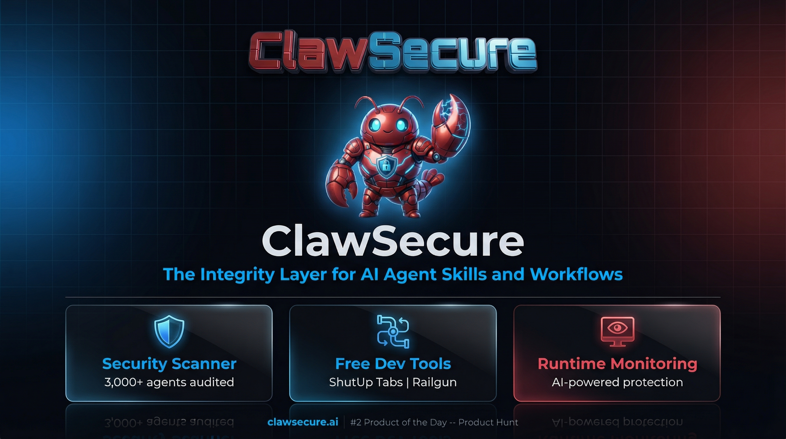

## ClawSecure

**The Integrity Layer for AI Agent Skills and Workflows**

ClawSecure builds the most secure AI agent developer tools on the market. We audit 3,000+ OpenClaw agent skills, provide AI-powered runtime monitoring and 24/7 Watchtower monitoring, and ship free, open-source tools that fix the everyday problems of working with AI agents.

### Global Threat Monitor

> **[Launch Interactive Threat Monitor](https://clawsecure.github.io/clawsecure-openclaw-security/)** — Live threat data from 9,515 findings across 3,000+ audited OpenClaw skills

### Free OpenClaw Developer Tools

New tools ship weekly. See the full collection: **[openclaw-developer-tools](https://github.com/ClawSecure/openclaw-developer-tools)**

| Tool | What It Does |
|------|-------------|
| **[Railgun](https://github.com/ClawSecure/railgun)** | Deterministic agent orchestration. YAML pipelines with runtime limits, concurrency caps, and per-step observability. |
| **[ShutUp Tabs](https://github.com/ClawSecure/shutup-tabs)** | Auto-closes Claude Code diff tabs in VS Code, Cursor, Windsurf, Antigravity, and all VS Code forks. |

### OpenClaw Security Platform

| Product | What It Does |
|---------|-------------|
| **[OpenClaw Security Scanner](https://github.com/ClawSecure/clawsecure-openclaw-security)** | Free security scanner. 3,000+ agents audited. 3-Layer Audit Protocol. OWASP ASI 10/10 coverage. |

---

[clawsecure.ai](https://www.clawsecure.ai) | [Product Hunt #2 Product of the Day](https://www.producthunt.com/products/clawsecure) | [@ClawSecure](https://x.com/ClawSecure)
